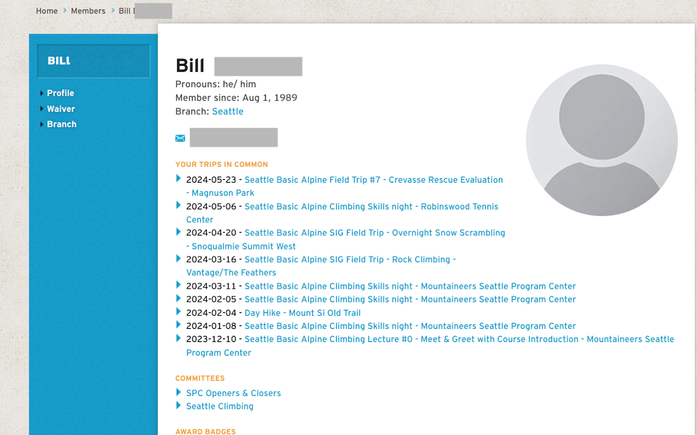

#  Mountaineers Trips in Common

An extension to show the number of trips and activities in common on Mountaineers trips.

Ever tried to remember just who that person is? "Did we hike up Norse Peak together, or were you on the Mt Si scramble last year?" The Trips in Common extension shows you your trips with other Mountaineers!

## Features

- For each person mentioned on an activity page, adds an annotation with the number of trips in common.  Hover over the annotation to get a popup list of the trips.
- For each person's profile page, adds a list of trips you've had in commmon with them to their profile page.

## Install

[**Chrome** extension]() <!-- TODO: Add chrome extension link inside parenthesis -->

Note that the first time you run it, the extension will take a few moments to load your past trips. The more activities you have participated in, the longer this will take.

## Warnings and Limitations

The extension uses local browser storage. Right now, it only keeps one person's records. If you log in as someone else on the same browser, the extension will get confused and may provide incoherent results.

## A Note on Privacy

The Mountaineers website allows you to see a fairly limited set of information about other people: you can go to their Members page to see what is public about them. In addition, for every activity, you can see the roster of people who are registered for it.

This extension looks only at the rosters of activities that **you** have attended. It looks only at information you can see, logged in as your credentials. 

## Behind the Scenes

When you start the extension for the first tiome, and go to a Mountaineers page while logged in

## Contribution

Suggestions and pull requests are welcomed!.

